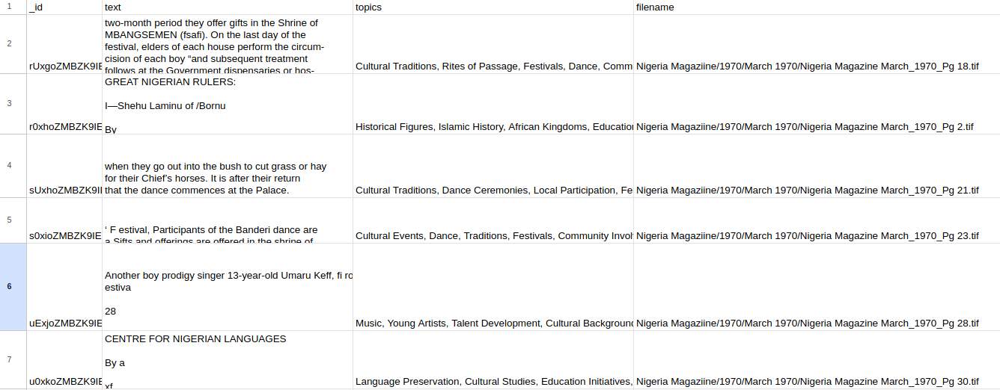

### Reasoning with Trees for Information Retrieval

Treebeard - A Monte Carlo Tree Search approach to deep research/report generation. This ~~library~~ hack uses MCTS for exploration, identifying knowledge gaps, and synthesizing findings into comprehensive reports. It combines vector store retrieval with targeted internet searches to gather evidence and optimise information discovery. The ~~algorithm~~ hack balances exploration and exploitation to deliver structured, high-confidence research outputs with citations and source tracking blah blah blah. You get the gist.


### Requirements

1. OpenAI key - set environment variable OPENAI_KEY
2. Google API key - set environment variable GOOGLE_API_KEY
3. Google custom search engine ID - set environment variable CUSTOM_SEARCH_ENGINE_ID

### Usage
```
vector_index = VectorIndex(docs)

# docs above is a list with the following structure; I did say it's a hack, didn't I.

@dataclass
class Document:
    id: str
    content: str
    keywords: str
    embedding: np.ndarray
    source: str
    url: Optional[str] = None

web_search = WebSearch(os.environ['GOOGLE_API_KEY'], os.environ['CUSTOM_SEARCH_ENGINE_ID'])
assistant = MCTSDeepResearch(
    vector_index, 
    web_search,
    text_generator, 
    embedding_generator,
    max_iterations=50
)

# outlineFromArchive - set to True if outline for the report should be generated from the documents in the vector index

outline, path, searches = assistant.generate_research_report("Economic development of Nigeria contrasting 1970 with current trends", outlineFromArchive=False)

report = assistant.generate_final_document(outline)
```

### Demo

`python -m treebeard.main --query "Economic development of Nigeria contrasting 1970 with current trends" --csv_path examples/archiving_1970.csv`

`archiving_1970.csv` is a file from <a href="https://archivi.ng">Archivi.ng</a>, a social good project where I'm an occassional volunteer ~~indentured slave~~. The file looks like this:



`text` is the text of the paper extracted via OCR

`topics` is a comma-delimited list of topics from the paper

The command above will generate a markdown file - [Generated Report](examples/Economic development of Nigeria contrasting 1970 with current trends_report.md)
0 with current trends_report.md)